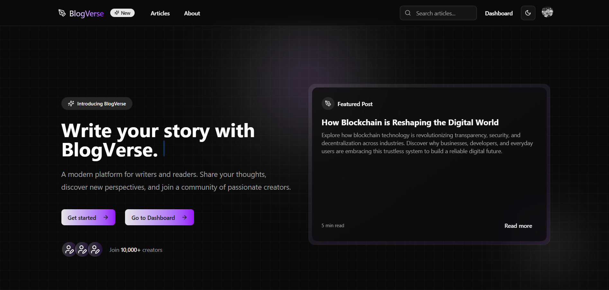
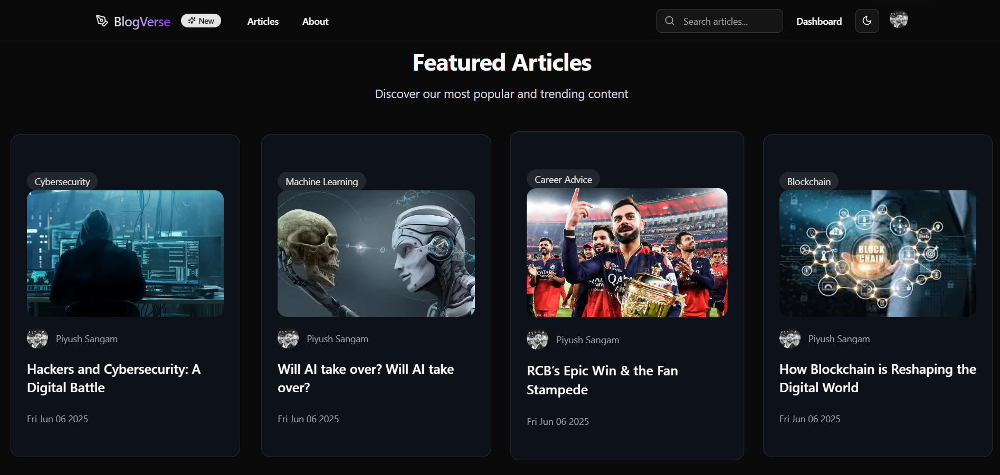

# 🚀 BlogVerse – Full-Stack SaaS Blogging Platform

**Live Demo → [https://blogverse-nu.vercel.app](https://blogverse-nu.vercel.app)**

**BlogVerse** is a modern, full-stack SaaS blog application built with Next.js. It allows users to seamlessly create, manage, and engage with blog content through a clean and responsive UI. With integrated **Stripe** payments and multi-plan support (Starter, Pro, Enterprise), it's ideal for writers, teams, and publishers aiming for scalability and performance.

---

## 🧩 Tech Stack

- **Frontend:** Next.js (App Router)
- **Backend:** Next.js 
- **Database:** NeonDB (PostgreSQL) + Prisma ORM
- **Authentication:** Clerk
- **Payment Integration:** Stripe
- **Deployment:** Vercel

---

## ⚙️ Features

- ✅ **User Authentication** – Sign up, Login, Logout via Clerk
- ✍️ **Create/Edit/Delete Blog Posts**
- 💬 **Commenting System** – Interact with articles
- ❤️ **Like Functionality**
- 🖊️ **Rich Text Editing** – Powered by `react-quill`
- 🧠 **Tag-Based Filtering**
- 🔍 **Search Functionality**
- 📈 **Admin Dashboard** – Track article count, comments, and analytics
- 🔄 **Pagination** – Optimized content loading
- 📱 **Mobile Responsive** – Modern, professional UI across devices
- 💳 **Stripe Payments** – SaaS Plan support: Starter, Pro, Enterprise

---

## 💡 SaaS Plans

Users can choose from three scalable plans:
- **Starter** – Basic features for beginners
- **Pro** – Extended capabilities for professionals
- **Enterprise** – Advanced tools for organizations

All plans are integrated using **Stripe Checkout** for secure transactions.

---

## 📦 Third-Party Libraries & Tools

- `stripe` – Payment processing
- `react-quill` – Rich text editor
- `@clerk/nextjs` – Authentication and user management
- `prisma` – Type-safe ORM for PostgreSQL

---

## 📸 Screenshots 


 

---

## 🧠 Learning Highlights

- Implemented full-fledged SaaS features with secure billing
- Learned to use Prisma with NeonDB for fast cloud PostgreSQL access
- Integrated Clerk for seamless auth and user experience
- Developed a modular, scalable full-stack application using modern Next.js architecture

---

## 🛠️ Setup Instructions

```bash
# 1. Clone the repo
git clone https://github.com/Piyush274/BlogVerse
cd blogverse

# 2. Install dependencies
npm install

# 3. Set up environment variables (Stripe, Clerk, DB URL, etc.)
.env.local

# 4. Run the development server
npm run dev

